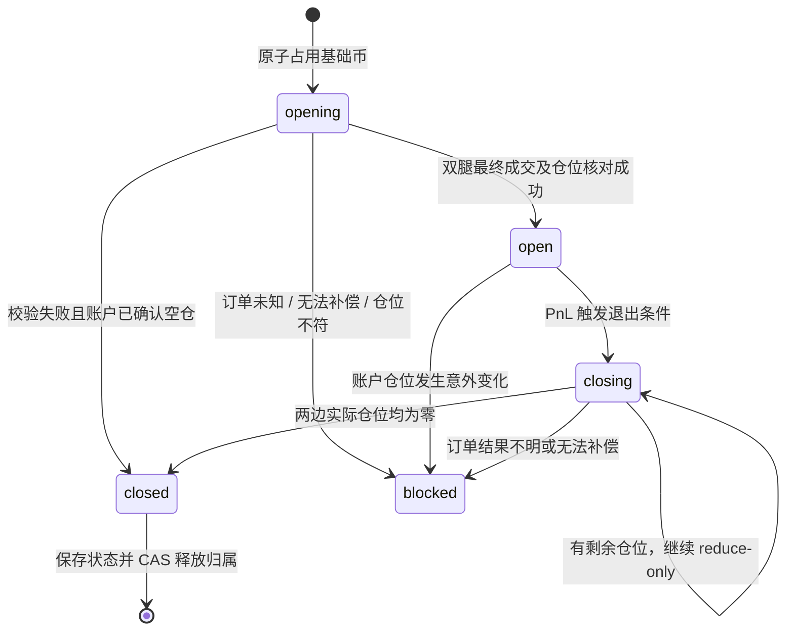

# 架构与协议约定

## 分层

- `models` 和 `strategy` 无网络依赖，数值不经过 float；时间戳允许 float。
- `Exchange` 为协议边界，输出统一基础币数量及 USD 估值。交易所报价币、单位倍数、张数乘数始终保留。
- `WebSocketTransport` 一个读协程负责消息分发；行情更新就地覆盖，避免把过时 tick 排入无界队列。RPC Future 用唯一 ID 关联，Gate ACK 不完成 Future。
- `ExecutionEngine` 处理归属、预校验、双腿并发执行、查单、补偿和仓位核对。
- `PairWorker` 管理轻量初筛→按需深度→执行→持仓 PnL 的过程。`main` 用 spawn 隔离进程；连接和 Redis 池都在子进程创建。

## 数据约定

`Instrument.symbol` 是 `BASE-QUOTE`，`base` 用于跨结算币配对及全局排他。`unit` 是一个报价单位包含的基础币数；`contract_size` 是一张合约对应多少原始单位。两者不可混用。`qty_step`、`min_qty`、`max_qty` 均为交易所原始数量单位；`Order.quantity`、`Fill.quantity`、`Book.Level.quantity` 均为真实基础币数量。

`Order.limit_price` 是每个真实基础币的 USD 估值。适配器转回原始价格后校验 tick。买入限价向下取整、卖出限价向上取整，不能因舍入扩大价格保护范围。Hyperliquid 额外校验五位有效数字和 `6-szDecimals` 小数限制。Gate 当前只下整数张，可能比交易所实际支持的分数张更保守。

别名只按明确的 `exchange:native` 配置，不通过正则猜测千倍币。添加别名前需确认两所实际资产和指数含义相同；名称相同不构成经济等价证明。接入 Gate USDT 线性合约、Hyperliquid 原生永续及 HIP-3。HIP-3 每个 DEX 独立实例，保留完整原生名称与实际抵押币，显式别名才允许跨所匹配；不支持反向及交割合约。

## 订单与持仓状态

订单 intent 必须先于网络发送落库。网络成功不等于成交成功，IOC 同样可能部分成交。`terminal=false` 或 `UNKNOWN` 不能计入仓位、更不能直接重试。查单结果在有限尝试后仍未知则冻结。每次确定成交只入账一次。

双边 IOC 无法构成原子交易；一腿明确拒绝后另一腿可能已经成交。补偿使用已成交较多一侧的反向 reduce-only 单，不追买另一边。若残差低于最小交易单位、深度不足或断线，程序冻结并保留现场，而非伪造对冲成功。

## Redis 约定

| 键（位于 namespace:mode 下） | 类型 | 用途 |
| --- | --- | --- |
| `owners` | hash | 基础币→唯一进程 owner，无 TTL |
| `positions` | hash | 最近持仓生命周期状态 |
| `orders` | hash | 客户端订单 ID→intent/最终结果 |
| `symbol_orders:BASE` | set | 标的订单索引 |
| `pnl` | hash | 最新深度平仓估值 |
| `events` | pub/sub | PnL 通知，不作为唯一持久记录 |
| `heartbeat:owner` | string + TTL | 进程可观测性，不用来抢锁 |
| `budget:exchange` | sorted set | 跨进程一分钟滑动订单窗口 |

钱包 nonce 位于 `namespace:wallet:address`，用 Lua 分配 `max(当前毫秒, 上次+1)`。此实现用于普通单节点 Redis；并未实现 Redis Cluster 的跨槽 hash tag。使用同一账户必须共享协调存储和命名空间，并保持持久化；不提供网络分区下的自动主从恢复保证。

冻结及已关闭记录留存用于审计；长期运行应制定订单日志归档策略。不能为了腾空间删除未完成订单、owner 或当前持仓。进程被杀死后原有 owner 保留；本版不自动跨进程接管实盘仓位。

## 断线与数据完整性

断开后立即清空盘口、中间价和标记价。重连登录完成后恢复订阅。Gate V2 初始 `full=true` 重建完整快照，后续 `U` 必须等于前次 `u+1`，跳号立即失效并退订/重订。Hyperliquid `l2Book` 每次替换完整快照。数据过期、盘口交叉和空盘不能参与成交判断。

REST 只用于规则及 Gate 实际仓位查询，后者用于交易前确认和执行后/定期核对。该确认增加入场延迟，是当前实现为账户一致性所做的取舍。需要更低延迟时，可扩展私有仓位推送和后台账户快照，但不能移除启动对账、断线失效及未知订单处理。

## 验证边界

测试覆盖数值转换、深度 VWAP、手续费门槛、精度拒绝、双边预校验、单腿拒绝、部分成交补偿、未知结果保留锁、已有仓位拒绝，以及 Lua 原子抢占/限额/nonce。公共元数据和 WSS 可在无密钥条件下验证。真实账户签名、账户模式、地区权限、保证金和实际成交需在专用账户上另行验收。

PNL 是固定 FX 折算的交易现金流估值，费用主要按配置 taker 费率估计；不包括资金费和实际汇兑损益。应先采集市场数据并校准中枢/阈值，再评估实盘可行性。

## 接口依据

- [Gate Futures WSS](https://www.gate.com/docs/developers/futures/ws/en/)
- [Gate 合约字段](https://github.com/gateio/gateapi-python/blob/master/docs/Contract.md)
- [Hyperliquid WebSocket post](https://hyperliquid.gitbook.io/hyperliquid-docs/for-developers/api/websocket/post-requests)
- [Hyperliquid WebSocket 订阅](https://hyperliquid.gitbook.io/hyperliquid-docs/for-developers/api/websocket/subscriptions)
- [Hyperliquid 价格和数量精度](https://hyperliquid.gitbook.io/hyperliquid-docs/for-developers/api/tick-and-lot-size)
- [Hyperliquid 官方签名 SDK](https://github.com/hyperliquid-dex/hyperliquid-python-sdk)
- [策略参考 entropy-arb](https://github.com/your-quantguy/entropy-arb/blob/main/README.zh-CN.md)

## HIP-3 市场身份

`hyperliquid:dex` 是运行器、订单、持仓和缓存中的独立市场身份；`hyperliquid` 保留原生语义。运行器展开 `HL_DEXS` 并只创建不同交易所家族的组合。每个组合使用自己的有序交易所列表计算溢价中枢，无共同标的的进程正常退出。

部署方的元数据和账户查询必须携带 dex；深度与成交匹配使用完整 coin。资产 ID 在原始数组上计算，不能先过滤下架项目或空 DEX 槽位。刷新时身份变化使行情失效并要求重新核对。抵押币通过 collateralToken 与 spotMeta 的 token index 关联，不假定为 USDC。无折算率的合约禁用，实盘缺少对应 DEX 费率则预校验失败。

不同 DEX 使用相同签名钱包时共享 Redis nonce；所有 Hyperliquid 市场共用订单预算桶。基础币别名统一后沿用原有全局归属，不按 DEX 拆锁。费用按成交 feeToken 折算；未知手续费币种保持 UNKNOWN，不确认对账完成。资金划转、杠杆配置及资金费收益不属于本次接入范围。
